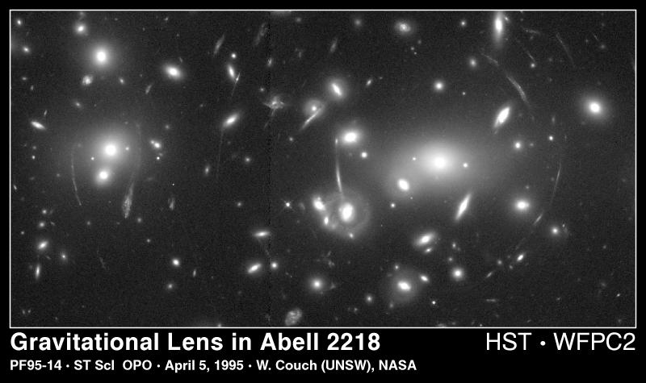
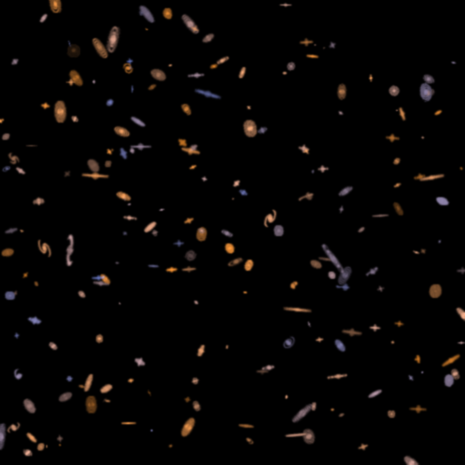
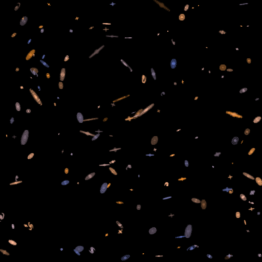
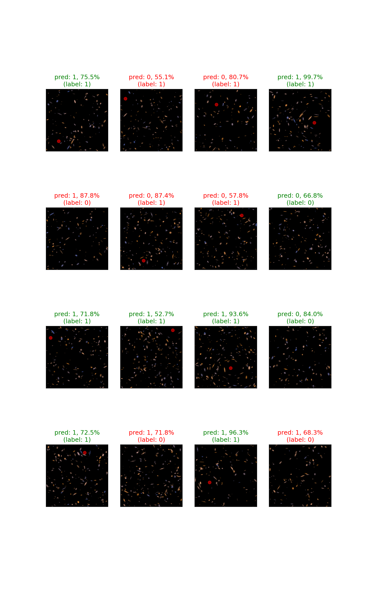

# Detecting dark matter

## Background

The picture below shows a cluster of galaxies that illustrates a phenomenon known as gravitational lensing.



In general, galaxies are expected to not prefer a specific orientation. The halo pattern in this image is believed to be caused by gravitational pull exerted by dark matter, on light emitted by the galaxies behind it.

## Dataset

The dataset is available in a storage bucket at gs://luminide-example-darkmatter. It contains images of simulated galaxy clusters. A patch of sky with no dark matter will have the galaxies oriented randomly as shown in this image.



Here is an example sky with an instance of the lensing effect.



Each sky in the dataset contains either 0 or 1 lens object. The task is to build a model that can detect the presence of a lens.

| Name                | Description                                             |
|---------------------|---------------------------------------------------------|
|training             | directory containing images for training                |
|validation           | directory containing images for validation              |
|training-labels.csv  | training labels (counts of lens objects)                |
|training-lenses.csv  | location of lens objects within the training images     |
|validation-labels.csv| validation labels (counts of lens objects)              |
|validation-lenses.csv| location of lens objects within the validation images   |


## Sample code

Instructions for using the sample code is given below:

1. Create directory structure

    ```
    mkdir darkmatter
    cd darkmatter
    mkdir code input output
    ```

2. Download code and install required packages
    ```
    cd code
    git clone git@github.com:luminide/example-darkmatter.git .
    pip install -r requirements.txt
    ```

3. Download data
    ```
    cd ../input
    gsutil -m rsync -r gs://luminide-example-darkmatter .
    dtrx training.zip validation.zip
    ```

4. Train and validate a model

    ```
    cd ../output
    ../code/full.sh
    ```

The validation accuracy is calculated and displayed for every epoch. Once the script finishes, there should be an image similar to the one shown below that shows the predictions and their confidence levels for a sample of images from the validation set.


